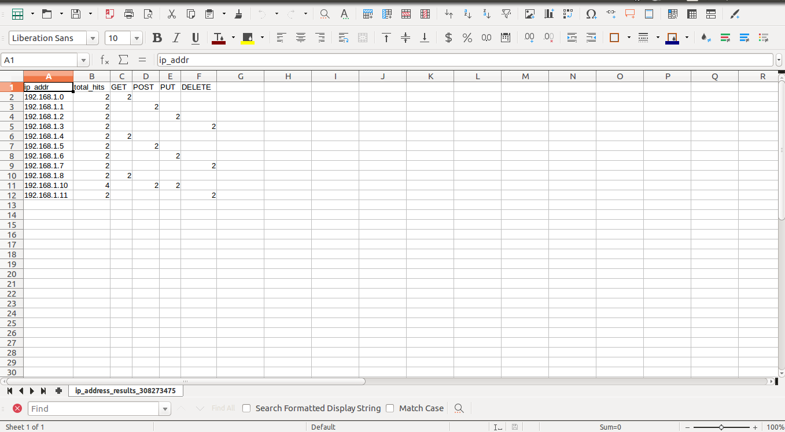
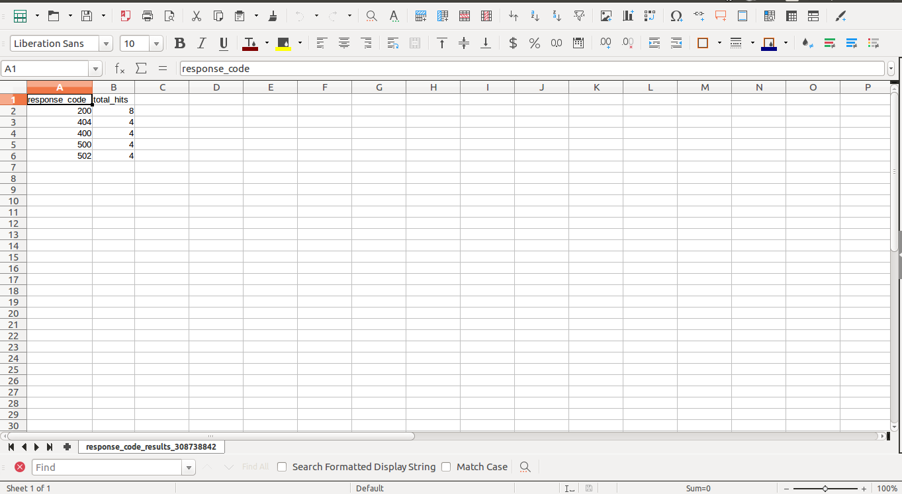

# RubyCSVAnalysis
This script processes a csv file and outputs the result back in a csv file.<br/>
Sample Input: AccessData.csv<br />
Command to execute:
```
ruby main.rb AccessData.csv AccessData2.csv
```
The command line can take n number of csv files and processes them all together.<br />
The results will be put in a result folder in the project root folder.<br />
It produces 2 types of results:
1. IP address related data:<br />
   Aggregated data for every IP address like,<br />
   a. Total number of hits from the IP address<br />
   b. Total number of GET requests from the IP address<br />
   c. Total number of POST requests from the IP address<br />
   d. Total number of PUT requests from the IP address<br />
   e. Total number of DELETE requests from the IP address<br />

<hr>
2. Response code related data:<br />
   Aggregated data for response codes for all requests

